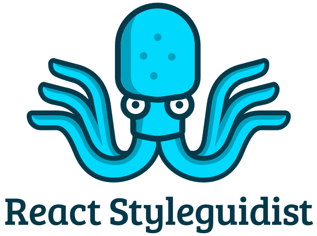
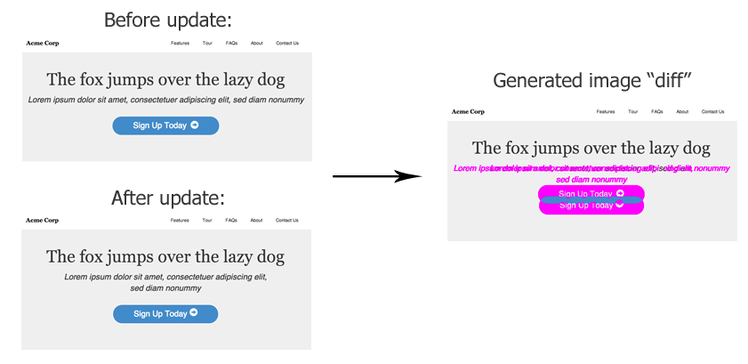
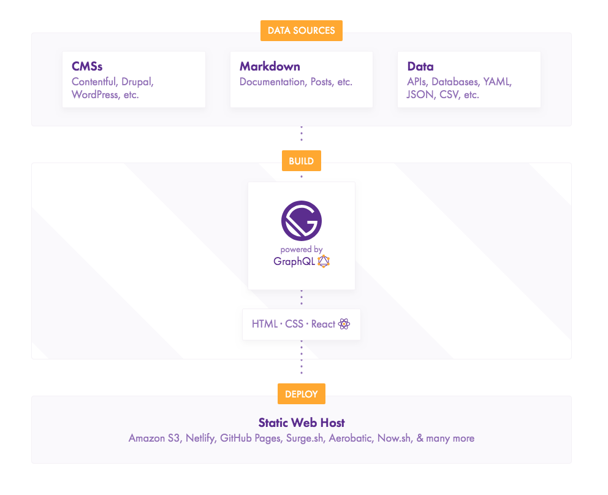

---

layout: ribbon

style: |

    #Cover h2 {
        margin:30px 0 0;
        color:#FFF;
        text-align:center;
        font-size:70px;
        }
    #Cover p {
        margin:10px 0 0;
        text-align:center;
        font-size:20px;
        }
    #Picture h2 {
        color:#FFF;
        }
    #SeeMore h2 {
        font-size:100px
        }
    #SeeMore img {
        width:0.72em;
        height:0.72em;
        }


    .slide--center {
      text-align: center;
    }
    .slide--center .slide__content {
      text-align: justify;
    }
    .no-title h2 {
      display: none;
    }
---

# <span class="guide">A practical guide</span> <span class="building">to&nbsp;building your</span> <span class="ds-infrastructure">design&nbsp;system&nbsp;infrastructure</span> {#Cover}

<marquee class="conveyor" direction="right">
<div markdown="1">

**line**
{: .svg .image .image--1 }
**line**
{: .svg .image .image--2 }
**line**
{: .svg .image .image--3 }
**line**
{: .svg .image .image--4 }
**line**
{: .svg .image .image--5 }
**line**
{: .svg .image .image--6 }
**line**
{: .svg .image .image--7 }
**line**
{: .svg .image .image--8 }
**line**
{: .svg .image .image--9 }
**line**

</div>
</marquee>

<b>Varya Stepanova</b>, Design Systems Expert / [varya.me](http://varya.me)
{: .author }

<script>

var conveyor = document.getElementsByTagName('marquee')[0];
var conveyor2 = conveyor.cloneNode(true);
setTimeout(function() { conveyor.parentNode.appendChild(conveyor2) }, 14800);

</script>

<style>

#Cover {
  padding-left: 60px;
  padding-right: 60px;
}

#Cover,
#Cover h2,
#Cover p
 {
  color: black;
}

#Cover h2 {
  font-size: 55px;
  margin-top: 0.25em;
  line-height: 1em;
  text-transform: capitalize;
}

#Cover h2 .guide {
  display: block;
  color: #38bcc2;
}

#Cover h2 .building {
  font-size: 40px;
  font-family: "Graphik Light";
  display: block;
  text-transform: uppercase;
  margin-top: 0.25em;
}

#Cover h2 .ds-infrastructure {
  color: #ca4e1f;
}

#Cover .conveyor {
  position: absolute;
  left: 0;
  top: 300px;
  white-space: nowrap;
  height: 225px;
}

#Cover .conveyor strong {
  font: 0/0 a;
  height:  3px;
  width: 20px;
  background-color: black;
  margin-left: -6px;
  line-height: 7px;
  color: transparent;
  display: inline-block;
}

#Cover .image {
  width: 100px;
}

#Cover .image--1 {
  margin-left: -6px;
}

#Cover .image--2 {
  margin-left: -9px;
  margin-bottom: -87px;
}

#Cover .image--3 {
  margin-left: -6px;
}

#Cover .image--4 {
  margin-left: -6px;
  margin-bottom: -35px
}

#Cover .image--5 {
  margin-left: -6px;
  margin-bottom: -5px;
}

#Cover .image--6 {
  margin-left: -9px;
  margin-bottom: -87px;
}

#Cover .image--7 {
  margin-left: -9px;
  margin-right: -6px;
}

#Cover .image--8 {
  margin-left: -13px;
  margin-bottom: -97px;
}

#Cover .image--9 {
  margin-left: -6px;
  margin-bottom: -14px;
  margin-right: -2px;
}

#Cover .author {
  margin-top: 275px;
  text-align: right;
}

</style>

<!--

Hello. Let's thank Andrey for his comprehensive introduction to the design systems and explaning their value. My name
is Varya and I am going to continue with the same topic. Since we are here at the React conference, I would
like to cover how we could apply React or even more generally speaking JavaScript to building design systems, providing
supplementary tools for them and measuring their success.

-->

## Me
{: .no-title .about-me }

{: .photo }

### Varya Stepanova
<b>Expert in Design Systems</b><br/>
<small>Frontend enginner, service designer</small>

#### Contacts
* [@varya_en](https://twitter.com/varya_en){: .twitter }
* [varya.me](http://varya.me){: .web }
* [mail@varya.me](mailto:mail@varya.me)
{: .contacts }

#### Areas of expertise
Design systems: production and governance,<br/>pattern libraries, style guides, UI/UX, front end.

<style>
.about-me p {
  font-size: 80%;
}
.about-me .photo {
  float: left;
  width: 300px;
  margin-top: 1em;
  margin-bottom: 6em;
  margin-right: 1em;
  border-radius: 50%;
}

.about-me h4 {
  color: #ca4e1f;
  font: 1em/1 'FF Meta Serif',sans-serif;
  margin-bottom: .5em;
}
.about-me b {
  font-size: 1.25em;
}

.about-me .contacts {
  line-height: 1;
  font-size: 0.8em;
}
.about-me .contacts li:before {
  content: '';
}

.about-me .twitter
{
  text-decoration: none;
  color: currentColor;
  background: none;
  border-bottom: 0;
}
.about-me .twitter::before
{
  content: "";
  display: inline-block;
  width: 1.5em;
  height: 1.5em;
  background-image:url('pictures/twitter-logo.png');
  background-size: cover;
  margin-right: 0.5em;
  margin-bottom: -0.5em;
}
</style>

<!--

First, a few words about myself. Design Systems has been my major focus even before the buzzword appeared. I have nearly
15 years of experience in frontend development, mostly doing the things related to the components on the web. Back then
it was CSS and JavaScript technologies for component production, later styleguides and pattern libraries, and nowadays
finally design systems. I worked on technical aspects of design systems in several projects and also did a lot of
oranizational work, technical evangelism and design system leadership. At the moment, I am self-employed expert in
design systems. I started my own consultancy and hope to be a help for the projects which need it.

-->

## Design system at <b>Elisa</b>
{: .elisa }

<object
    class="ea-logo"
    type="image/svg+xml"
    title="Elisa"
    data="http://static.elisa.fi/components/pattern-library/6.3.0/release/images/elisa-logo.svg#{$modifiers}"></object>

* Library of CSS components
* Libraries of React components
* UI kit
* Shared tools and practices
* Great design community
* World-class front-end teams

<style>

.elisa .ea-logo {
  position: fixed;
  top: 45px;
  left: 550px;
}

.elisa h2 {
   display: inline-block;
}

.elisa h2 b {
  display: none;
}

.ea-logo {
  width: 200px;
  height: 80px;
  margin: 0 15px -15px;
}

</style>

<!--

The examples and ideas I will be giving are based on experience of working with design system at Elisa.

For those who are not from Finland or Estonia, Elisa is our local telecommunication operator and content provider with a
long history and dozens of digital products which are offered under the same brand.

Elisa Design System is a huge product which includes several UI libraries. Some libraries are in React but there is also
a plain HTML/CSS library which still needs a lot of automations and technological support.

Besides, there is a large UI kit in Sketch.

Apart from technical perspecitive,
design system at Elisa means communication practises, visual guidelines, shared processes and tools.

So, during the last year, I had a lot of opportunities to apply different technologies for supporting this ecosystems,
making processes smooth and more transparent.

-->


## What is design systems?
{: .what-is-ds .slide--shout .slide--highlighted }

{: .svg .image }

<style>
.what-is-ds .image {
  width: 250px;
}
</style>

<!--

Now, let's define once again what design systems are.

In the context of React as technology, ecosystem and community, design systems are often mentioned as high-level
component libraries. This is indeed a huge aspect of them but a solid design system is never only a library.

Of course, many companies start from library and later have a very strong technical aspect of that. But sooner or later
we find out that design system is much more.

-->


## What is it for me?
{: .slide--center }

<div class="triple" markdown="1">

{: .svg .role--developer }

* Release notes
* Documentation
{: .next }

{: .svg .role--designer }

* Tone of voice
* Design specs
{: .next }

{: .svg .role--manager }

* Strategy
* Roadmap
{: .next }

</div>

<!--

Let's have a look what people of different specializations need from a design system.

As a developer using a design system, I would like to have access to release notes, maybe some general documentation
about the system, not only about components separately.

As a designer, I also want to be involved, and have not so much tenhnical but design-focused information.

As a project manager or owner, I need shrinked prepresentation but more information about the upcoming content in the
design system, their roadmap and such plans.

And let's keep in mind that there are also business levels. People there would like to have a larger scale picture,
maybe even with numbers of how much we earn or
save.

-->


## Design Systems <i>[in <b>React</b> world]</i>
{: .react-world .slide--center }

- …shared practices
- …tools
- …processes
- …community
{: .list }

<style>

.react-world h2 i {
  color: #000;
  font-style: normal;
  text-transform: none;
}

.react-world h2 i b {
  color: #61DAFB;
  font-family: -apple-system,BlinkMacSystemFont,Segoe UI,Roboto,Oxygen,Ubuntu,Cantarell,Fira Sans,Droid Sans,Helvetica
  Neue,sans-serif;
}

.react-world .svg {
  margin: 50px 100px;
}

.react-world .list {
  position: relative;
  margin-left: 50%;
  margin-top: 4em;
}

.react-world .list li.current {
  font-family: 'Graphik Medium';
}

.react-world .list li:after {
  position: fixed;
  top: 50%;
  left: 25%;
  width: 200px;
  margin-top: -100px;
  margin-left: -50px;
  display: none;
}

.react-world .list li.current:after {
  display: block;
}

.react-world .list li:nth-child(1):after {
  content: url('pictures/icons/web-design/042-solution.svg');
}
.react-world .list li:nth-child(2):after {
  content: url('pictures/icons/web-design/029-settings.svg');
}
.react-world .list li:nth-child(3):after {
  content: url('pictures/icons/user-experience/040-algorithm.svg');
}
.react-world .list li:nth-child(4):after {
  content: url('pictures/icons/web-design/039-sharing.svg');
}
</style>

<!--

As it is yet evolving concept, our understanding of it is changing, so there is no definition. But speaking from
experience, I would say that a design system is

  - Shared practises, based on which you design your product or bunch of products under the same brand. Components go
  here, but this is not only about them. The practises can be more abstract or more design related such as visual
  language or tone of voice. Or on the contrary, they can be deeply technical and reflect your approach to code.
  - This brings us to tools which our company could have for all the developers and designers to share. As we are speaking
  about design systems as a way of standartizing, they fit there.
  - At some level, design systems would mean the processes which are followed in the company to achieve the outlined
  goals.
  - Finally, working with our fellow developers, designers and project owners as with a community also resonates with
  design system goals.

Even though the components were only mentioned in the beginning, we can apply technologies to all of these aspects of
design systems.
In this presentation I will share some ideas how we can use React and its ecosystem to help design systems on all the
levels.

-->


## To react or not to react?
{: .react-or-no .slide--shout .slide--primary }

{: .svg .image }

<style>
.react-or-no .image {
  width: 250px;
}
</style>

<!--

First, I would like to explain why it's about React. Because indeed the components does not have to be React.

As I said, my experience also was with a plain CSS/HTMl library which seems to be not related to the topic of React. But
let's have a closer look.

-->


## Living style guides
{: .living-styleguides .slide--center }

{: .styleguidist }
{: .storybook }
<i class="whatever">💁</i>

<b class="next">Only for React libraries or..?</b>

<style>

.living-styleguides .slide__content {
  text-align: center;
}

.living-styleguides .styleguidist,
.living-styleguides .storybook,
.living-styleguides .whatever {
  width: 230px;
  margin: 25px;
}

.living-styleguides .styleguidist {
  margin-bottom: -1.25em;
}

.living-styleguides .whatever {
  display: inline-block;
  font-size: 120px;
  width: 150px;
  font-style: normal;
  line-height: 1em;
}

</style>

<!--

I think all of you are familiar with Styleguidist and Storybook. Or maybe some have experience with other similar
solutions.

It is good to use them as a development playground. The components there are isolated so that we can practise
style-guide driven development.
Style guides are themselves documentation websites which is exactly what we need for a design system.
And these tools often have a lot of useful plugins which could be huge help to the development process.

But this is all for the React projects. What if I have my components as plain HTML/CSS or implemented with some other
component technology? Is it possible to still use these tools?

-->


## How to document?
{: .documenting }

<div class="double" markdown="1">

#### brand-button.scss

```
// Brand button
//
// markup:
// <button
//   class="brand-button">
//     Click here!
// </button>
```
{: .code }


#### BrandButton.md

    # Brand button
    ```
    <button
      className="brand-button">
        Click here!
    </button>
    ```
{: .code }

</div>

<style>

.documenting .code {
  font-size: 0.8em;
}

</style>

<!--

What we need to enjoy Styleguidist or Storybook? We should have our code snippets in a special format. It is in markdown
for Styleguidist and in JavaScript for Storybook.

On the screen, to the right you can see an example of how a button si documented for Styleguidist. From now on, I will
be reffering to Styleguidist only. However, keep in mind that the idea also works for Storybook and for any other
similar tool.

With our plain HTML/CSS library we usually also have similar documentation for components but maybe in different
formats. At Elisa, we had these snippets as comments in CSS code and there was a custom tool to parse those comments.
You can see the example on the screen to the left.

Basicaly, to enjoy the Styleguidist, we should stop writing left and start writing right. However, this might break a
lot of things in our own set up and also be challenging for the people to change the way of documenting they are used
to.

-->


## React for non-React
{: .slide--center .react4non-react }

* Parse code snippets
* Reactify
  ```
  <button class="myButton">
  <button className="myButton" />
  ```
  {: .code }
* Create stories
* <b>Automate</b>
{: .list }

<style>

.react4non-react .slide__content {
  text-align: center;
}

.react4non-react .list {
  text-align: left;
  margin: 0 auto;
  width: 500px;
}

</style>

<!--

Then, if we want this documentation in React-friendly format, we can automatically translate it with some script.
And after that, we simply run the tool over the gotten source.

This way, you don't have to change the way how you write your docs and you don't break the familiar process for your
people. But you already have Styleguidist in use.

Then, Styleguidist can be used as a playgorund for development or it can be customized as a documentation website.

Also, consider this automation as a small step towards new technologies. One day they will come to your project as well.
By that time you already have some set up for the tools.

-->


## Designers update libs
{: .designers-update-libs .no-title .slide--center }

<blockquote class="twitter-tweet" data-lang="en"><p lang="en" dir="ltr">Designers updating their design libraries 🥵 <a href="https://t.co/ojFRhj8Smo">https://t.co/ojFRhj8Smo</a></p>&mdash; Alex 🌚 (@alexmuench) <a href="https://twitter.com/alexmuench/status/1111297292215246850?ref_src=twsrc%5Etfw">March 28, 2019</a></blockquote>
<script async src="https://platform.twitter.com/widgets.js" charset="utf-8"></script>

<style>

.designers-update-libs .slide__content {
  text-align: center;
}

.designers-update-libs twitter-widget {
  transform: scale(0.75) translateY(-125px) !important;
  margin: 0 auto !important;
}

</style>

<!--

Why is it all needed and why did I start to speak about that?

Recently I saw this funny tweet. Let's run it in a separate window. In here we can see a designer updating their design
libraries. The tweet if funny but the situation it reffers to is scary. And sad. And true.

Often happens that design work is organized on a low technical level and so there is a lot of waste work. Even is design
process itself is nicely organized, it's trnaslation into the code often is not optimal at all. Then we do work as the
video shows.

-->


## React <b>= friendly environment and tools</b>
{: .friendly }

* Development playground
* Autogenerated docs
* <b>Plugins</b>

<style>

.friendly h2 b {
  font-size: 0.8em;
  display: block;
  color: #38bcc2;
}

</style>

<!--

I think that React can help us here. By using tools from its ecosystem we offer the team different automations which
make the design and development process smoother. It is much easier for people to contribute into a library if
everything works automatically. By using the tools you can offer coding designers a friendly environment and so close the gap
between specializations. Non-coding designers can soon participate as well since they see how smooth and beneficial
the process is.

Once we have such a system working, the next step would be applying different plugins. Which plugins — depends on your
specific needs but I give you one example.

-->


## This is CSS
{: .no-title .this-is-css }

{: .meme}

<style>
.this-is-css {
  text-align: center;
}
.this-is-css .meme {
  height: 500px;
}
</style>

<!--

Everything depends on the problem we are trying to solve. This picture is about CSS, there are dozens of them in the
internet. Yeah, CSS can bring us such surprises.
Editting something we can break the things in some other place. So, its is much recommended to have some automated
visual regression tests  and run them regularly.

-->


## Visual regression tests
{: .vr-tests }


<style>
.vr-tests {
  text-align: center;
}
</style>

<!--

This picture I often show to illustrate what sometimes our job looks like when not having visual regression tests.
Indeed, sometimes when providing changes we do need to check very carefuly what else has changed. It might be
time-consuming, not creative or interesting thing at all, and very inefficient.

But thanks to the existing tooling, we can have
visual regression tests for your components quite nicely and without much pain.

-->


## Visual regression tests
{: .slide--center .vr-tests-2 .no-title }

{: .image }

#### with Styleguidist or Storybook
### Get visual tests with one `npm install`

<style>

.vr-tests-2 .slide__content {
  text-align: center;
}

.vr-tests-2 .image {
  height: 350px;
}

</style>

<!--

I have a lot of experience with custom set ups. They served the purpose but took much more time to maintain. So, I think
it is always better to re-use the community work and adopt the common solution.

Both Styleguidist and Storybook have additional plugins for visual regression tests, sometimes more than one. I did not
check recently if somthing new appeared but usually there is a variety to choose from. In general, it is usually a
package to unstall and then run a command. That simple.

Combining this idea with generating documenttaion from custom source, you can take advantage of the plugins even for
non-React projects.

This is
not only about visual tests. If we generalize the idea, we can think about using React ecosystem for non-React projects.
-->


## Style Guide <b>vs</b> Design System
{: .style-guide_design-system .slide--shout .slide--primary-light }

{: .svg .image }

<style>
.style-guide_design-system b {
  text-transform: lowercase;
}

.style-guide_design-system .image {
  width: 250px;
}
</style>

<!--

Now, let's recollect that design system is not only a library. Style guide is a necessary thing to have when
communicating your design system. But it's not the only thing. What we can implement for the design systems if consider
them in wider perspective?

-->


## Design systems - connecting people
{: .no-title .connecting-people }

{: .cover }

<div class="slogan" markdown="1">

### Design systems
#### Connecting People

</div>

<style>

.connecting-people .slide__content {
  text-align: center;
}

.connecting-people .slogan {
  background-color: white;
  width: 820px;
  height: 250px;
  text-align: center;
  margin-top: 275px;
  padding-top: 1.5em;
}

.connecting-people h3 {
  font-family: "Graphik Medium";
  color: black;
  font-size: 70px;
}

.connecting-people h4 {
  font-size: 50px;
  margin-top: -0.5em;
}

</style>

<!--

Design systems are meant to enhance the collabiration in a multidisciplinary team. Or the collaboration of many teams
if we are speaking about larger organization. 

So, the role of a design system is to create environment such a collaboration.

-->


## Single point of truth
{: .single-point .slide--shout .slide--highlighted }

{: .svg .image }

<style>
.single-point .image {
  width: 250px;
}
</style>

<!--

Design system itself is "Single Point of Thurth", a place, a tool a thing which communicates you how to build and
maintain the products. This single point of truth needs proper representation, something real, from where we get the
info.

-->


## Design system website
{: .ds-website .slide--center }

* patterns
* visual language
* processes
* community
* design tokens
* notes
* design principles
* documentation
* guidelines
* naming conventions
* brand
* vocabulary
* changelog
{: .tag-cloud }

{: .gatsby-logo .next }

<style>

.ds-website .slide__content {
  text-align: center;
}

.ds-website .tag-cloud {
  display: inline;
  list-style-type: none;
  width: 400px;
}

.ds-website .tag-cloud li {
  list-style: none;
  display: inline;
}
.ds-website .tag-cloud li:before {
  display: none;
}

.ds-website .tag-cloud li:nth-of-type(3n + 1) {
    font-size: 1.5em;
}
.ds-website .tag-cloud li:nth-of-type(4n+3) {
    font-size: 2em;
}
.ds-website .tag-cloud li:nth-of-type(5n - 3) {
    font-size: 1.25em;
}

.ds-website .gatsby-logo {
  width: 400px;
}

</style>

<!--

A styleguide website which documents the components cannot be such a place but only a part of it. Style guide
communicates how to use existing patterns. But we should also know how to make new patterns, how to provide brand
changes, what are the design and development processes and so on. There should be a website which contains all this
information.

At the same time, it's good to automate as much as possible. So, it dictates the technical solution behind the website.
It can be whatever you as a developer is comfortable with. My own experience was with GatsbyJS.
Gatsby has a lot of plugins and it is quite easy to
write your owns. So, it is very flexible and can easily respond your organization needs. I can show you some things I
implemented with it, but beware there is no limits.

-->


## How Gatsby works
{: .gatsby-basics .slide--full-image }

{: .schema }

Credits: Robert Ngo, [Decoupling Drupal with Gatsby](https://evolvingweb.ca/blog/decoupling-drupal-gatsby)
{: .credits }

<style>

.gatsby-basics .schema {
  height: 100%;
}

.gatsby-basics .credits {
  transform: rotate(-90deg) translateY(475px);
  font-size: 0.75em;
  color: grey;
}

</style>

<!--

Just to put you into context, this is a schema of how Gatsby processes data. It's very approximate since Gatsby is very
flexible. But the main thing here is that you can provide different sources in whatever formats. It can be data from CMS
or data from markdown files on the file system, or data grabbed from third party services. Gatsby combines this all
together and at the website you can have an access to it via GraphQL. Out of this data, Gatsby builds a static website.
Again, as a developer you can 100% control how this build happens.

In the case I am describing, the website was built based on markdown. It does not mean that this is a final version of
it. But for a developer, it was quite easy option to start with.

-->

## Design system website
{: .ds-website-structure }

### example of structure
{: .subtitle }

<div class="double" markdown="1">

```
content/
  pages/
    docs/
    about/
      team/index.md
      workflow/index.md
      index.md
  posts/
    welcome-to-new-ds-website/
      index.md
      thumb.png
```
{: .file-structure }

* Home
* Docs
* Style Guide
* Blog
* About

</div>

<style>

.ds-website-structure .file-structure code {
  line-height: 1.5em;
  font-size: 0.75em;
}

</style>

<!--

This is a source structure of Gatsby website I was workinng with. Basically, the website
had a structure of pages and one of the sections is blog. You can see that the pages and blog posts are stored in
folders where there are markdown files. Once built, it goes onto the website as corresponding web pages.

The structure I am showing here is not something I recommend for every design system to have. It is just an example of a
very simple website. When developing real design system website, every company should set up their own custom
structure.

-->


## Use your superpowers
{: .superpowers .slide--shout .slide--primary }

{: .svg .image }

<style>
.superpowers .image {
  width: 200px;
}
</style>

<!--

And let's go even further to see what we as developers can offer to make such a design system website unbelievable. Just
a bunch of ideas.

-->


## React components in texts
{: .react-in-markdown }

<div class="double" markdown="1">

components/BodyText.js
```
const renderAst = new rehypeReact({
  createElement: React.createElement,
  components: {
    <mark class="important">'comp-my-button': MyButton,</mark>
  },
}).Compiler;
```
{: .code }

pages/my-page/index.md
```
title: Title of your page
---
Page text and living
<mark class="important"><comp-my-button></comp-my-button></mark>.
```
{: .code }

</div>

<style>

.react-in-markdown .double {
  margin-right: -2em;
  column-rule: 1px solid lightgrey;
}

.react-in-markdown .code {
  font-size: 0.75em;
}

</style>

<!--

As I said, Gatsby has a lot of plugins. One of them makes it possible to use your React components in markdown texts.
When renddered, you have a React component functioning in the browser. It requres to list all the components you are
going to have, but overall it is possible.

This way you
can get React components from your library and describe them in a very flexible way on pages. A designer can write a
text an illustrate it with the component.

Even if your components are not in React but let's say in plain HTML/CSS, you
still can provide generic React interface for them, similar to how it was done for usign Styleguidist or Storybook.
This will simplify writing the documentation and also smoothly teach non-React people how beuatiful React is.
Constrantly, they shift their mind from HTML snippets to React tags, and this will help with adopting the technology all
over the company, if you need this.

-->


## Custom React components
{: .custom-react .slide--center }

{: .svg .image }

* Interactive schemas
* Adjustable docs
* Cartoons
* <s>Entertainers</s> Problem solvers
{: .list }

<style>

.custom-react .image {
  position: fixed;
  top: 50%;
  left: 25%;
  width: 200px;
  margin-top: -100px;
  margin-left: -50px;
}

.custom-react .list {
  position: relative;
  margin-left: 50%;
  margin-top: 4em;
}

</style>

<!--

We can alo make custom components. They are not from your library but whatever else. Here only your fantacy can
limit you. This way you create interactive documentation. Here are some examples from my experience:
* Pattern Journey
* Changelog (but later we did it differently)
* Cartoon about flow

Such components make plain documentation more interesing to read. We can consider this as entertaining the people. But
in fact, even if it is a cartoon, it is a very serious thing valid for the business. Such interactive documentation
solves the problem of information availability. Which means, it serves to connecting people and providing information.

-->


## Interactive changelog?
{: .interactive-changelog .slide--center }

{: .svg .image }

Get <span class="plain">plain data</span> from GitHub<br/> 
and represent it in a <span class="friendly">friendly interface</span>!
{: .idea }

<style>

.interactive-changelog .slide__content {
  text-align: center;
}

.interactive-changelog .image {
  width: 200px;
}

.interactive-changelog .idea {
  font-size: 1.25em;
}

.interactive-changelog .plain {
  color: grey;
  font-family: 'Graphik Medium';
}

.interactive-changelog .friendly {
  background-image: linear-gradient(to left, violet, indigo, blue, green, yellow, orange, red);   -webkit-background-clip: text;
  color: transparent;
  font-family: 'Graphik Medium';
}

</style>

<!--

For example, we can renpresent changelogs of the libraries. In GitHub they are stored as static pieces of text which is not super
convinient when our fellow developers want to upgrade through many versions. We can improve GitHub flow and based on the
extracted data make some kind of interactive changelog. This again smooths the learning curve and makes things easier
for the people. I remind you that being user-friendly is one of the most important things in design systes, because it's a service!

-->


## One single point of truth
{: .deps-info }

### Extract info from packages and repos

<div class="double" markdown="1">

Make your design system website a place where all the info can be found at any time.<br/>
<b>Display markdown from libraries, tools and related repositories on the website pages.</b>

{: .svg .connection }

</div>

<style>

.deps-info .connection {
  width: 300px;
}

</style>

<!--

Being one single point of truth, it is good if the design system website gets data from different sources and shows it
at the page.

For example, if there is several libraries, you can have them as dependencies and get their Readme description as a
markdown. This markdown can again be a source of the corresponding pages of the website. This way, your users do not
need to surf the GitHub to get infromation about the libraries. They have everything needed at the website.

The process of extracting these data can be automated. So that when a new version is released, we re-build the pages.

-->


## Little bit more
{: .little-bit-more .slide--shout .slide--primary-light }

{: .svg .image }

<style>
.little-bit-more .image {
  width: 250px;
}
</style>

<!--

What else? Let's now see if and how we can involve the whole community into design system development.

-->


## Welcome to contribute
{: .contribute .reward }

### Input

```
<input placeholder="Placeholder Text"
    class="input" type="text" value="" />
```
{: .code }

Text inputs are accompanied by a label and wrapped inside a fieldset. The :hover and :focus styles follow our brand
colors.

[Edit this page on GitHub](){: .edit }


<!--

There are different governance models for design systems.
Sometimmes there is a dedicated team for its development, sometimes the whole process goes spontaniously. But in all the
cases community work is welcomed.
Contribution to documentation or sharing
the ideas is also very crucial. At the end of the day, no one else but design system users know it from users'
perspective.

In order to involve the community into the Design System project, give them as much way to contribute as possible. Here
again the Gatsby choice and hosting the source on GitHub helps a lot. It can be GitHub Entreprise, but with access for
all the employees.

We allow people to propose their text or code changes. If it is via GitHub pull requests, it is quite safe as still is
reviewed by the team. But very important that all the colleagues, anyone of them feels a bit as an owner of the project.
Smart books call it "emotional ownership", so don't skip this aspect.

There is a bit of learning curve for non-technical people here. But not so large, they don't have to make any fork. Just
provide a link to editting via GitHub interface and it's done. The pull requests can come as patches.

This definetely speeds up the process, plays a large role in keeping the docs up-to-date and in general makes the design
system *alive*.

-->


## Reward the contributors
{: .reward }

### Input

25.04.2019 · Contributors
<i class="github-userpic github-userpic--freiksenet"></i>
<i class="github-userpic github-userpic--saravieira"></i>
<i class="github-userpic github-userpic--bebraw"></i>

```
<input placeholder="Placeholder Text"
    class="input" type="text" value="" />
```
{: .code }

Text inputs are accompanied by a label and wrapped inside a fieldset. The :hover and :focus styles follow our brand
colors.

[Edit this page on GitHub](){: .edit }

<style>

.reward .slide__content {
  border: grey 1px solid;
  padding: 1em 1em 0;
  font-size: 0.75em;
}

.reward .code {
  background-color: black;
  color: lightyellow;
  padding: 1em;
  font-size: 0.8em;
}

.reward .github-userpic {
  display: inline-block;
  width: 30px;
  height: 30px;
  border-radius: 50%;
  background-size: cover;
  vertical-align: middle;
  margin: 0 0.125em;
  margin-top: -0.25em;
}

.reward .github-userpic--bebraw {
  background-image: url(https://avatars3.githubusercontent.com/u/166921?s=460&v=4);
}

.reward .github-userpic--freiksenet {
  background-image: url(https://avatars0.githubusercontent.com/u/172936?s=460&v=4);
}

.reward .github-userpic--saravieira {
  background-image: url(https://avatars0.githubusercontent.com/u/1051509?s=460&v=4);
}

.reward .edit {
  color: black;
  background-color: lightgrey;
  background-image: none;
  display: inline-block;
  padding: 0 0.5em 0 1em;
  font-size: 0.8em;
  position: relative;
}

.reward .edit:after {
  display: block;
  content: '';
  border-top: 1em solid transparent;
  border-bottom: 1em solid lightgrey; /* 40px height (20+20) */
  border-left: 1em solid lightgrey;
  position: absolute;
  top: 0;
  right: -1em;
}

</style>

<!--

And a little tip here. If everything is editted with GitHub, we can alanyze the source history and get the names of all
the contributors. It pays respect for people's work and I'm sure it is very pleasing to see yourself in the list.

Secondary, it helps
people to communicate. They can see whom to ask about specific things.
-->


## Share information
{: .blogging }

<blockquote class="twitter-tweet" data-lang="fi"><p lang="en" dir="ltr">Most design problems are really people problems.</p>&mdash; zeldman (@zeldman) <a href="https://twitter.com/zeldman/status/1112840913636745216?ref_src=twsrc%5Etfw">1. huhtikuuta 2019</a></blockquote>
<script async src="https://platform.twitter.com/widgets.js" charset="utf-8"></script>

### Blogging
{: .next .list-title }

* Announcements
* Plans and strategies
* Involving the community
* <b>Everyone takes stage</b>
{: .next .list }

<style>

.blogging twitter-widget {
  transform: scale(0.75) translateY(-125px) !important;
  display: inline !important;
}

.blogging .list-title {
  transform: rotate(270deg) translateX(195px) translateY(-385px);
  font-size: 1.5em;
}

.blogging .list {
  margin-left: 2.5em;
  margin-top: -1em;
}

</style>

<!--

The contribution usually starts from a small thing like fixing a typo. But once people realize that they can easily
operate the tools, they get no limits. And this helps us to solve the problems we are solving. Which I believe is rarely
something technical but most often people problems.

By providing a place which is single point of truth for a design system, we can connect people. We can help them to
start a dialog and to collaborate.

One of the tools for such people interaction would be blogging.

As a design system representatives, we can ourselves provide a lot of information in blog format. For example,
announcements of what has been implemented. We can also speak about the future describing plans and strategies. Blogging
is less strict format, it makes people much comfortable to give the feedback. So, such plans can be altered by this
feedback. Here the in-house design and development community is already involved.

They can also themselves write posts into such a blog. As long as everyone within the organization has access to the
design systems website repository, they can write they own markdown texts and create pull requests with the new content.

-->


## Cherish in-house blogging
{: .sources }

<div class="container" markdown="1">

{: .source .source1 }
{: .source .source2 }
{: .source .source3 }
{: .source .source4 }
{: .source .source5 }
{: .source .source6 }
<div class="source source__fade"></div>
{: .source .source--last }

</div>

{: .arrow }
{: .graphql }
{: .arrow }
{: .gatsby }
{: .schema }

### Give familiar interface

People are not used to writing markdown and edit files on GitHub?
Offer them <b>Wordpress as a source</b> for your design system website blog.

<style>

.source .slide__container {
  text-align: center;
}

.sources .container {
  position: relative;
}
.sources .source {
  width: 150px;
  margin-top: 15px;
  position: absolute;
  top: 0;
  left: 0;
  animation-name: SourceLogo;
  animation-duration: 3s;
  opacity:0;
}

@-webkit-keyframes SourceLogo {
  0% {
    opacity: 0;
  }
  50% {
    opacity: 1;
  }
  100% {
    opacity: 1;
  }
}

@keyframes SourceLogo {
  0% {
    opacity: 0;
  }
  50% {
    opacity: 1;
  }
  100% {
    opacity: 1;
  }
}

@-webkit-keyframes SourceFade {
  0% {
    opacity: 1;
  }
  99% {
    opacity: 0;
  }
  100% {}
}

@keyframes SourceFade {
  0% {
    opacity: 1;
  }
  99% {
    opacity: 1;
  }
  100% {
    opacity: 0;
  }
}

.sources .source1 {
  animation-delay: 0;
}
.sources .source2 {
  animation-delay: 3s;
}
.sources .source3 {
  animation-delay: 6s;
}
.sources .source4 {
  animation-delay: 9s;
}
.sources .source5 {
  animation-delay: 12s;
}
.sources .source6 {
  animation-delay:15s;
}
.sources .source--last {
  opacity: 1;
  z-index: -2;
}
.sources .source__fade {
  display: inline-block;
  content: '';
  width: 200px;
  height: 200px;
  position: absolute;
  background-color: white;
  z-index: -1;
  opacity: 0;
  animation-name: SourceFade;
  animation-duration: 18s;
}

.sources .schema {
  margin-left: 150px;
}

.sources .graphql {
  width: 150px;
}

.sources .gatsby {
  width: 250px;
  margin-bottom: 15px;
}

.sources .arrow {
  width: 100px;
  margin: 50px 0;
}

</style>


<!--

If makrdown sounds too technical and not so much welcoming, you can use other sources. For example, not everyone finds
blogging experience nice with Makrdown. Then, you can offer them faniliar solution, maywe Wordpress? With Gatsby, you
can get data from there and still represent it on the website. This way, Wordpress acts like CMS. If it destroys
barriers, then it's definitely a solution to go.
-->


## Show meta data
{: .meta-data .slide--shout .slide--highlighted }

{: .svg .image }

<style>
.meta-data .image {
  width: 250px;
}
</style>

<!--

The design

-->


## What is our design system
{: .what-is .slide--center }

<div class="double" markdown="1">

{: .svg .image }

### Get the data

* Crawl repositories
* Inject scripts on production
* Grab data from task managers

{: .svg .image }

### Show the data

* Numbers
* Links
* Charts

</div>

<style>

.what-is .slide__content {
  padding-left: 2.5em;
  text-align: left;
}

.what-is .image {
  width: 100px;
  margin-left: 3em;
}

</style>

<!--
## Crawling the repositories to calculate the usage of components
This is more about measuring the impact of design systems, which is another huge topic. BTW, I am very much in it right
now and if you would like to have a chat about it, please welcome to speak after the talk or in social networks. But
again, from automation perrspective, if all the projects are in some repositories, let's say on GitHub Enterprise, wee
can crawl repos and calculate the usage of components. Works for React components and for re-use of CSS classes.
Similarly, we analyse dependencies in `package.json` at the projects and so we can learn the versions used.

Links: to the usage of the components

Most metrics cannot show much on their own but are more valuable in dynamics. As design system is usually not a solid
product but constansly evolving thing (I would even say it's a process), we would like to "measure" that we are doing
better not worse. For a human being, it's much more readable as a chart of graph. So, we can store gathered information
and represent it on the weebsite as a chart component. TODO: Give examples.
-->

## Design systems as a service
{: .slide--shout .ds-service }

{: .svg .image }

<style>

.ds-service h2 {
  color: black;
}

</style>

<!--

As I mentioned, design system is a service and when providing tooling around it, you should consider your fellow
developers and the users. Service design offers methods to develop new ideas and sharp the services for the users. Like,
user-centred design etc. The ideas presenetd above were very much developed based on propoper user research which I made
with my colleagues on existing design system. Usign similar methods, you can develop your own ideas or combine with the
presented and shape your design system up to the needs of your company and projects.
-->


## Thank you
{: .thanks }

{: .photo }

### A Practical Guide TO BUILDING YOUR Design System Infrastructure

### [Slides: varya.me/react-finland-2019](http://varya.me/react-finland-2019/)
{: .slides }

#### by Varya Stepanova
* [@varya_en](https://twitter.com/varya_en){: .twitter }
* [varya.me](http://varya.me){: .web }
* [mail@varya.me](mailto:mail@varya.me)
{: .contacts }


#### Credits
{: .credits__title }
This pressentation used icons made by [Freepik](https://www.freepik.com/){: title="Freepik" } and
[Eucalyp](https://creativemarket.com/eucalyp){: title="Eucalyp" } from [www.flaticon.com](https://www.flaticon.com/){: title="Flaticon" }.
They are licensed by
[CC 3.0 BY](http://creativecommons.org/licenses/by/3.0/){: title="Creative Commons BY 3.0"}.
{: .credits }

<style>

.thanks .credits,
.thanks .credits__title {
  font-size: 0.5em;
}

.thanks h3 {
  font-size: 28px;
  margin-bottom: 0.5em;
  margin-top: 1em;
  line-height: 1.25em;
  font-family: "Graphik Light";
}

.thanks .slides,
.thanks .slides a {
  color: #ca4e1f;
  font-family: "Graphik Light";
  text-transform: none;
}

.thanks .photo {
  float: left;
  width: 150px;
  margin-top: 1em;
  margin-bottom: 8em;
  margin-right: 1em;
  border-radius: 50%;
}

.thanks .contacts {
  line-height: 1;
  font-size: 0.8em;
}
.thanks .contacts li:before {
  content: '';
}

.thanks .twitter
{
  text-decoration: none;
  color: currentColor;
  background: none;
  border-bottom: 0;
}

.thanks .twitter::before
{
  content: "";
  display: inline-block;
  width: 1.5em;
  height: 1.5em;
  background-image:url('pictures/twitter-logo.png');
  background-size: cover;
  margin-right: 0.5em;
  margin-bottom: -0.5em;
}
</style>
